<picture>
  <source media="(prefers-color-scheme: dark)" srcset="assets/scenery-dark.svg">
  
</picture>

  <code><a href="https://ishuu.me">ishuu.me</a></code> &nbsp;
  <code><a href="https://www.linkedin.com/in/eswar854/">linkedin</a></code> &nbsp;
  <code><a href="https://github.com/ishuu9837">github</a></code> &nbsp;
  <code><a href="https://www.instagram.com/ishuu.me/">instagram</a></code> &nbsp;
  <code><a href="mailto:founder@ishuu.me">email</a></code>

<picture>
  <source media="(prefers-color-scheme: dark)" srcset="assets/card-dark.svg">
  
</picture>

<picture>
  <source media="(prefers-color-scheme: dark)" srcset="assets/journey-dark.svg">
  
</picture>

<picture>
  <source media="(prefers-color-scheme: dark)" srcset="assets/skyline-dark.svg">
  
</picture>

<picture>
  <source media="(prefers-color-scheme: dark)" srcset="assets/live-dark.svg">
  
</picture>

## Projects

| Project | | What it is |
| :-- | --: | :-- |
| **Few-shot histopathology** | 🔬 | M.Tech research, in progress. Cross-domain few-shot classification of breast histopathology images: multi-scale CNN features and multi-head self-attention, adapted with MAML. BreaKHis to BACH, in PyTorch. |
| **[EduSentinel](https://edusentinel.vercel.app)** | [live](https://edusentinel.vercel.app) | NumPy-only deep autoencoder that flags abnormal learning behaviour in LMS data across 8 features. 99.40% ROC-AUC, 100% recall. Flask demo. |
| **[Smart Energy Grids](https://smart-energy-grid-app.vercel.app)** | [live](https://smart-energy-grid-app.vercel.app) | Demand forecasting and adaptive grid control with LSTM and big data, plus an interactive energy-balance demo. |
| **[MRS by Letterboxd](https://movie-recommendation-using-letterbo.vercel.app)** | [live](https://movie-recommendation-using-letterbo.vercel.app) | Film recommender with genre encoding and cosine similarity. Filters for title, language, year and genre. |
| **Heart Disease Prediction** | | Deep autoencoder on the UCI Heart Disease dataset, 96.3% accuracy. L1/L2 regularisation, dropout, threshold tuning, class-imbalance handling. |
| **[Image Colourisation](https://github.com/ishuu9837/IMAGE-COLORIZATION)** | [repo](https://github.com/ishuu9837/IMAGE-COLORIZATION) | U-Net convolutional autoencoder in LAB colour space on CIFAR-10 with VGG perceptual loss. Migrated from TensorFlow to PyTorch. |
| **[Real-Time Face Detection](https://github.com/ishuu9837/REAL-TIME-FACE-DETECTION)** | [repo](https://github.com/ishuu9837/REAL-TIME-FACE-DETECTION) | OpenCV pipeline storing detected faces in MongoDB. 1,000+ FPS, 30% speed boost. |
| **[Galaxy Glide](https://github.com/ishuu9837/GALAXY-GLIDE)** | [repo](https://github.com/ishuu9837/GALAXY-GLIDE) | Responsive interactive front end in HTML, CSS and JavaScript. 40% faster page load, 35% higher engagement. |

## Toolkit

**Languages**

    

**AI & ML**, the frameworks I train and ship with

     

**Agentic AI**, the tools I build with

  

**Frontend & 3D**

    

**Data, cloud & design**

       

## Experience

| Period | Company | Role |
| :-- | :-- | :-- |
| Jan 2025 – Jul 2025 | **Freelancer.com** | Personal Tutor (Maths, Stats & Python) |
| Nov 2024 – May 2025 | **Fiverr** | Freelance Researcher |
| Jan 2025 – Apr 2025 | **Slash Mark IT Solutions** | Python Developer Intern |
| May 2024 – Jun 2024 | **OctaNet Services** | Python Developer Intern |

<b>The detail</b>

 

**Freelancer.com** · Personal Tutor (Maths, Stats & Python)
- Taught a global student base with personalised lesson plans and interactive coding sessions

**Fiverr** · Freelance Researcher
- Statistical analysis and research consulting: data cleaning, validation, regression

**Slash Mark IT Solutions (OPC) Pvt. Ltd** · Python Developer Intern
- Python automation scripts for client workflows, data handling and API integration

**OctaNet Services Pvt. Ltd** · Python Developer Intern
- Task-automation scripts, small product features, debugging and optimisation

## Education

| Period | Institution | Programme |
| :-- | :-- | :-- |
| 2025 – 2027 | **GITAM (Deemed to be University)**, Hyderabad | M.Tech, Data Science · 8.95 CGPA |
| 2021 – 2025 | **Parul University**, Vadodara | B.Tech, CSE (Artificial Intelligence) · 7.13 CGPA |

## Certifications

| Certification | Issuer | |
| :-- | :-- | :-- |
| Professional Certification in Data Science & AI | IIT Roorkee via Intellipaat, 2025 · A Grade | [certificate](https://tih.iitr.ac.in/certificate/intellipaat/IPTIH25070775.jpg) |
| Introduction to Machine Learning | NPTEL / Coursera · 100/100 | |
| Introduction to Cybersecurity | Cisco | [badge](https://www.credly.com/badges/2f2ea326-f082-4302-adad-f97ff5e5eef4) |
| Python Essentials 1 | Cisco · 100/100 | [badge](https://www.credly.com/badges/038d86bf-0279-4e10-9751-9c3c0a5c195e/linked_in_profile) |
| Python Essentials 2 | Cisco · 100/100 | [badge](https://www.credly.com/badges/2ebedeb7-139b-42af-ab17-7c387deb94d6/linked_in_profile) |

## Publications

| Paper | |
| :-- | :-- |
| EduSentinel: Anomaly Detection in Education Using a Deep Autoencoder | Dec 2024 |
| Real-Time Face Detection Using OpenCV | Dec 2024 |

Both on ResearchGate.

  <a href="https://ishuu.me"><b>ishuu.me</b></a> ·
  <a href="mailto:founder@ishuu.me">founder@ishuu.me</a> ·
  <a href="https://www.linkedin.com/in/eswar854/">LinkedIn</a> ·
  <a href="https://github.com/ishuu9837">GitHub</a> ·
  <a href="https://www.instagram.com/ishuu.me/">Instagram</a>

M.Tech Data Science, GITAM · Hyderabad · remote friendly

